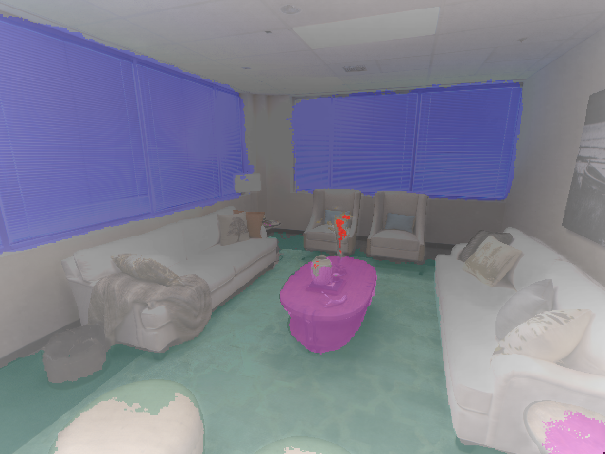

### About me
I am a PhD candidate, at the [MAPS Lab](https://maps-lab.github.io/) and the [School of Informatics - University of Edinburgh](http://web.inf.ed.ac.uk/ipab), sponsored by the [Edinburgh Centre for Robotics](https://www.edinburgh-robotics.org/), under the supervision of [Prof. Chris Xiaoxuan Lu](https://christopherlu.github.io/) and [Prof. Oisin Mac Aodha](https://homepages.inf.ed.ac.uk/omacaod/). My research objective is to improve the real-time spatial perception in robotics, utilizing Neural Fields. 

In November 2021, I completed with distinction the **Artificial Intelligence master's programme** at the University of Edinburgh. For my master's dissertation project I worked on a novel inference and learning algorithm for [generative capsule models](https://github.com/tsagkas/capsules), under the supervision of [Prof. Chris Williams](https://homepages.inf.ed.ac.uk/ckiw/).

In 2019, I was awarded the **Diploma of Electrical and Computer Engineering**, from the University of Patras, in Greece (graduated 4th in my class out of 202 students – GPA: 8.11 out of 10). I completed my ECE Diploma thesis under the supervision of [Prof. Athanassios Skodras](http://www.ece.upatras.gr/skodras/), researching the use of CNNs for [real-time hand-gesture recognition](/projects/2_project/) via sEMG signals. Our work was presented at the IISA'19 international conference. 

Moreover, working under the supervision of [Prof. Konstantinos Moustakas](http://www.vvr.ece.upatras.gr/members/konstantinos-moustakas/) at the [VVR group](http://www.vvr.ece.upatras.gr/), I researched the use of Haptics in self-driving vehicles, by taking part in the 2nd Student Challenge in Automotive Haptics, at the [WHC'19](http://www.worldhaptics2019.org/) in Tokyo, Japan, where our team received the "Best Student Innovation Challenge Award".

### projects

  

      
  

  

    

        VL-Fields: Towards Language-Grounded Neural Implicit Spatial Representations
    

    

        Workshop on Effective Representations, Abstractions, and Priors for Robot Learning - ICRA 2023
    

    

        <b>Nikolaos Tsagkas</b>, Oisin Mac Aodha, Chris Xiaoxuan Lu
    

    

      <a href="../vl-fields/">[Project Page]</a>  
      <a href="https://arxiv.org/abs/2109.06241">[Paper]</a>  
    

  

 

  

      
  

  

    

        Incremental Abstraction in Distributed Probabilistic SLAM Graphs https://tsagkas.github.io/vl-fields/
    

    

        ICRA 2022
    

    

        <b>Joseph Ortiz</b>, Talfan Evans, Edgar Sucar, Andrew J. Davison
    

    

      <a href="../vl-fields/">[Project Page]</a>  
      <a href="https://arxiv.org/abs/2109.06241">[Paper]</a>  
      <a href="https://www.youtube.com/watch?v=ZoJ9ylb4Ss8">[Video]</a>
    

  

 

<!-- 

  

      
  

  

    

        Incremental Abstraction in Distributed Probabilistic SLAM Graphs https://tsagkas.github.io/vl-fields/
    

    

        ICRA 2022
    

    

        <b>Joseph Ortiz</b>, Talfan Evans, Edgar Sucar, Andrew J. Davison
    

    

      <a href="../vl-fields/">[Project Page]</a>  
      <a href="https://arxiv.org/abs/2109.06241">[Paper]</a>  
      <a href="https://www.youtube.com/watch?v=ZoJ9ylb4Ss8">[Video]</a>
    

  

  -->